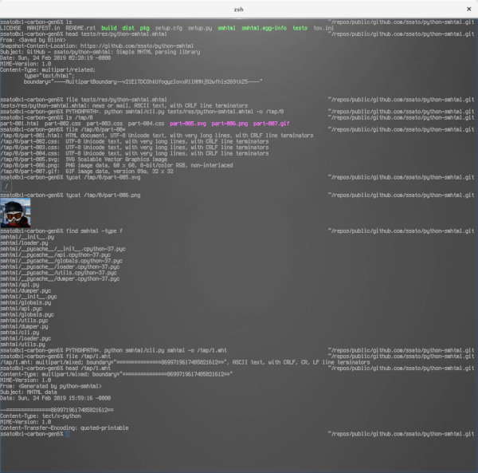

=================
python-smhtml
=================

About
======

.. .. image:: https://img.shields.io/pypi/v/smhtml.svg
   :target: https://pypi.python.org/pypi/smhtml/
   :alt: [Latest Version]

.. .. image:: https://img.shields.io/pypi/pyversions/smhtml.svg
   :target: https://pypi.python.org/pypi/smhtml/
   :alt: [Python versions]

.. image:: https://api.travis-ci.org/ssato/python-smhtml.png
   :target: https://travis-ci.org/ssato/python-smhtml
   :alt: [Test status]

.. image:: https://coveralls.io/repos/ssato/python-smhtml/badge.png
   :target: https://coveralls.io/r/ssato/python-smhtml
   :alt: [Coverage Status]

.. .. image:: https://landscape.io/github/ssato/python-smhtml/master/landscape.png
   :target: https://landscape.io/github/ssato/python-smhtml/master
   :alt: [Code Health]

This is a simple and experimental python library to parse and dump MHTML [#]_ data.

- Author: Satoru SATOH <satoru.satoh@gmail.com>
- License: MIT

.. [#] https://en.wikipedia.org/wiki/MHTML

Misc
======

Here is a demo screenshot to show its CLI frontend can extract files from MHTML
data and make (dump) MHTML data from files.

.. vim:sw=2:ts=2:et:
